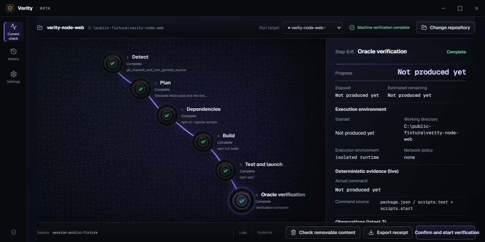

# Verity

**Verity checks whether a repository you trust can build, test, launch, and pass its real checks on your computer.**

[](https://github.com/logi-cmd/verity/actions/workflows/ci.yml)
[](https://agent-guardrails.com/download/)
[](./LICENSE)

[Official download](https://agent-guardrails.com/download/) · [How it works](https://agent-guardrails.com/how-it-works/) · [Verification receipts](https://agent-guardrails.com/verification-receipts/) · [Supported stacks](https://agent-guardrails.com/supported-stacks/) · [Code signing policy](./docs/code-signing-policy.md)



## What `verified` means

Verity reads committed manifests, lockfiles, scripts, and test settings to find runnable targets. It records why each command is needed, runs an isolated copy of the repository, and checks the result in a way that fits the target. It signs a local receipt only when every required step passes and the source has not changed.

A running process, an open port, or a visible window is not enough. Missing locks, ambiguous commands, snapshot drift, an unavailable runtime, and a weak oracle remain blocked or explicitly unverified.

Verity is for source you already trust. It is not a hostile-code sandbox, remote attestation service, malware verdict, or general security certification.

## Source beta

The current release is `v0.1.0-beta.2`. The official download page links to the source release and release evidence. Prebuilt desktop installers are unavailable until trusted signing and platform acceptance evidence exist.

Build the CLI from source:

```powershell
git clone https://github.com/logi-cmd/verity.git
cd verity
cargo build --release -p verity-cli
cargo run -p verity-cli -- inspect C:\path\to\repository --json
```

Run the Desktop web build or Tauri development app:

```powershell
npm --prefix desktop install
npm run build:desktop-web
npm run dev:desktop
```

## CLI

```powershell
verity inspect C:\path\to\repository --json
verity check C:\path\to\repository --target node-0123456789
verity receipt SESSION_ID
verity verify-receipt C:\path\to\receipt.json --repository C:\path\to\repository --json
verity runtime doctor
```

`verify-receipt` returns `verity-receipt-verification.v1`. It accepts only a current `verity-verification-receipt.v3` receipt with a valid Ed25519 signature, matching repository and snapshot fingerprints, and a `verified` result. The JSON response does not include source, paths, logs, or command output.

## Agent Guardrails integration

[Agent Guardrails](https://github.com/logi-cmd/agent-guardrails) remains an independent MIT project. When a receipt is supplied explicitly, it invokes the Verity CLI without a shell:

```powershell
agent-guardrails check --verity-receipt C:\path\to\receipt.json --review
```

An accepted receipt provides runtime verification evidence only. It does not satisfy scope, security, protected-path, required-command, or evidence-file requirements.

## Supported stacks

Deterministic adapters are implemented for Node.js, Deno, Bun, static web, Rust, Tauri, Python, Go, Godot, Docker Compose, Java, Kotlin, C, C++, .NET, PHP, and Ruby.

The adapters do not all have the same level of testing. Each target reports whether its plan is complete, whether it can run on the current machine, and how the result is checked. See [support status](https://agent-guardrails.com/supported-stacks/) and [release evidence](./docs/release-status.md) for details.

## Local data boundary

No account is required. Verity has no telemetry or upload transport. Repository snapshots, raw receipts, paths, logs, source, and command output remain on the current machine. An allowlisted diagnostic report is created only when you explicitly preview and save it.

## Development

```powershell
cargo fmt --all -- --check
cargo test --workspace
npm run test:contracts
npm run test:licenses
npm run test:site
npm run build:desktop-web
```

Contributions are welcome through [issues](https://github.com/logi-cmd/verity/issues) and pull requests. Read [CONTRIBUTING.md](./CONTRIBUTING.md) and [SECURITY.md](./SECURITY.md) before submitting a change.

## License

MPL-2.0. See [LICENSE](./LICENSE).
